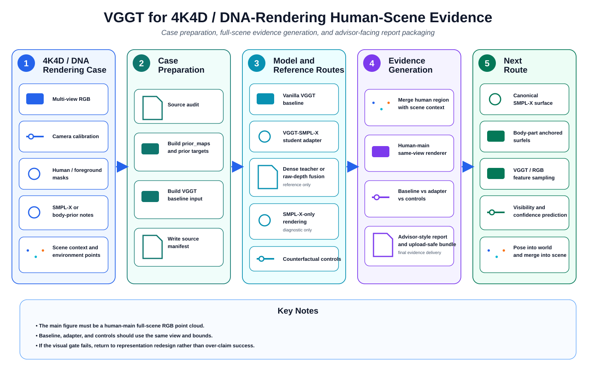

# VGGT for 4K4D / DNA-Rendering Human-Scene Evidence

<p align="center">
  
</p>

## Route Position

This repository is the **case-preparation and evidence route** for 4K4D / DNA-Rendering style experiments in the VGGT + SMPL-X project.

If the model-side adapter is where the prior is injected, this repository is the place where the project is forced back to its original visual target: a **human-main full-scene RGB point cloud**.

The repository therefore sits between data preparation and final presentation.

- It prepares 4K4D-style cases.
- It organizes baseline and control outputs.
- It renders same-view comparison figures.
- It packages advisor-facing evidence.

## Why This Route Matters

A recurring problem in human reconstruction projects is that the result can look good only after the scene context is removed.

That is not the standard used here.

The project goal is not simply to show an isolated person-like point cloud. The goal is to improve the human region **inside a VGGT scene reconstruction pipeline**, while still preserving enough environment to show that the result remains scene-level and not just crop-level.

This repository exists to keep that requirement explicit.

## What the Route Organizes

The repository works with a 4K4D / DNA-Rendering style case that may contain:

- multi-view RGB,
- camera calibration,
- human or foreground masks,
- SMPL-X or other body-prior annotations,
- scene context / environment points.

From there, it organizes a practical evidence pipeline:

1. source audit,
2. prior-target preparation,
3. baseline-input preparation,
4. baseline / adapter / control collection,
5. same-view full-scene visualization,
6. advisor-style report packaging.

## Baseline, Adapter, and Reference Routes

The repository is also the place where several outputs are kept side by side.

These usually include:

- the vanilla VGGT baseline,
- the VGGT-SMPL-X student adapter output,
- teacher or raw-depth fusion references,
- SMPL-X-only renderings for diagnosis,
- counterfactual controls.

Putting these outputs together in one place is important because the central question is comparative: **did the adapter improve the scene-level human reconstruction more convincingly than the baseline and controls?**

## Mentor Visual Requirement

The key visual requirement of the wider project is encoded directly in this repository.

The main figure should be a **human-main full-scene RGB point cloud**. That means:

- the human should be the visual subject,
- some environment should remain visible,
- baseline and adapter should be shown under the same scene bounds and view,
- controls should be available for comparison.

By contrast, the following are auxiliary only:

- isolated human crops,
- projection overlays,
- SMPL-X-only visualizations,
- teacher-only fusion results.

They may be useful in analysis, but they are not the main evidence figure.

## How the Repository Closes the Loop

The repository is meant to support an experimental loop rather than a single screenshot.

A typical run in this route looks like this:

- prepare one trusted case,
- generate or import the vanilla baseline,
- generate or import the student adapter result,
- collect control outputs,
- render all outputs from the same view,
- compare them under the same scene bounds,
- write an advisor-facing report and bundle.

That loop gives the project a clearer notion of what improved, what did not, and whether a claimed improvement is really visible in 3D.

## Recommended Reading of the Result

As in the rest of the project, three levels should be kept separate:

1. **Metric pass**: numbers improve.
2. **Visual pass**: 3D morphology looks better.
3. **Advisor pass**: the full-scene evidence is convincing enough as the main project figure.

This repository is where the third question becomes unavoidable.

## Current Status

This route should be understood as the **evidence and presentation layer** of the project.

Its value lies in keeping the project honest. It prevents the work from stopping too early at a crop, a projection, or a teacher reference, and pushes the comparison back to the real delivery target: a readable human inside a full-scene RGB point cloud.

## Figure

The architecture figure above is stored in:

```text
docs/figures/vggt_4k4d_human_scene_evidence_architecture.svg
```
