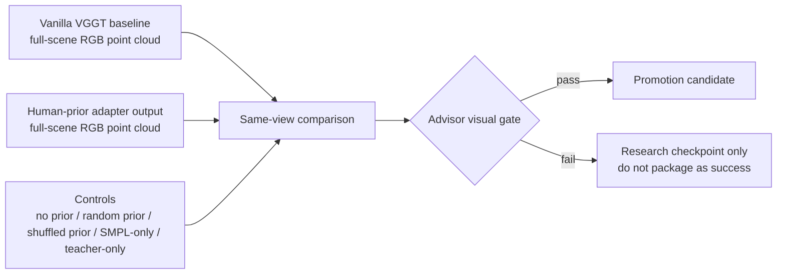
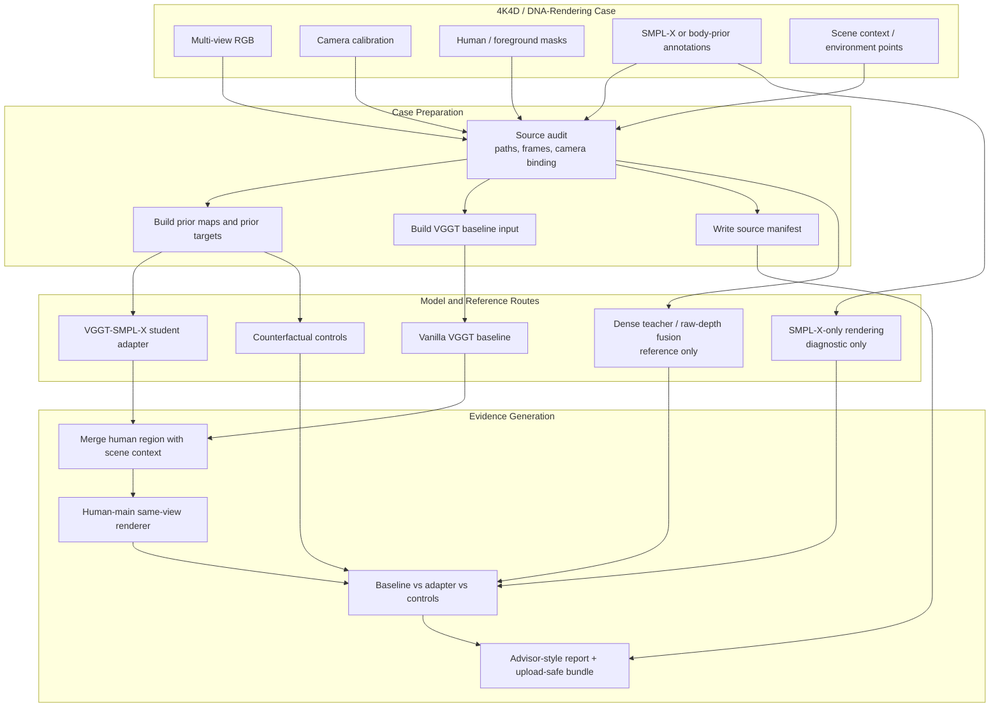
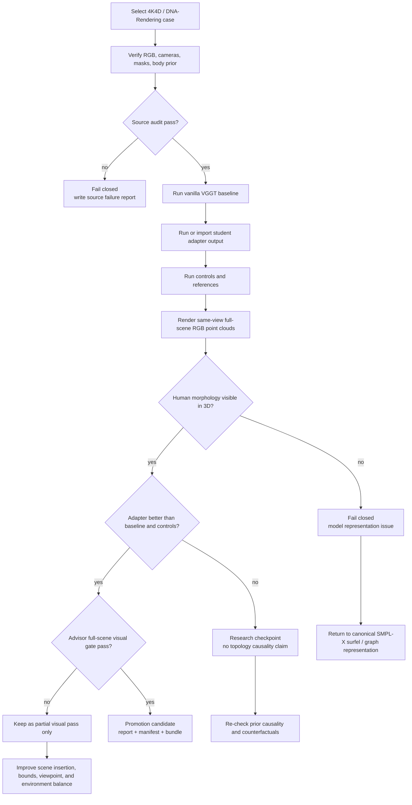

# VGGT for 4K4D / DNA-Rendering Human-Scene Evidence

A 4K4D/DNA-Rendering-oriented research repository for preparing **VGGT full-scene human reconstruction cases**, generating **baseline/control evidence**, and supporting the wider **VGGT + SMPL-X human prior** project.

This repository is the **scene-evidence and dataset-case layer**. It should preserve the original requirement of the project: the main advisor-facing result must be a **human-main full-scene RGB point cloud**, not an isolated human crop, SMPL-only body, or teacher-only fusion.

---

## Project Position

This repository is the **4K4D / DNA-Rendering case and evidence repository** in the VGGT + SMPL-X project family.

| Repository | Role |
|---|---|
| `VGGT-SMPL-X-Human-Prior-Adapter` | Model-side adapter: SMPL-X prior injection, VGGT feature/token route, student model experiments. |
| `VGGT-ZJU-Mocap-Adapter` | ZJU-MoCap bridge: camera/mask/body-prior alignment, multi-view case export, dataset diagnostics. |
| `vggt_for_4k_4d` | 4K4D/DNA-Rendering case preparation, full-scene evidence, baseline/control comparison, advisor-style report packaging. |

The primary function of this repository is to keep the evidence standard honest: the result must remain a scene-level VGGT output where the human body is the visual subject and the environment is still present.

---

## Core Goal

The long-term research goal is to make VGGT produce better human-region 3D geometry by using SMPL-X as a structural prior, while still preserving full-scene RGB point clouds.

For this repository, the concrete goal is narrower:

1. prepare 4K4D/DNA-Rendering-style multi-view cases,
2. run or collect vanilla VGGT baselines,
3. collect adapter outputs from the model-side repository,
4. build same-scene visual comparisons,
5. generate upload-safe evidence bundles and advisor-facing reports,
6. fail closed when the visual evidence does not satisfy the full-scene human-main requirement.

---

## Mentor Visual Requirement

The main figure for advisor review must satisfy all of the following:

- full-scene RGB point cloud or human-main scene point cloud,
- human body occupies the main visual area while still retaining some environment points,
- head, torso, limbs, hands/feet, and overall pose are readable in 3D,
- same coordinate system, same bounds, same view, and same point size for baseline and adapter comparison,
- VGGT baseline, adapter result, and controls shown side by side,
- projection overlays and isolated scatters used only as auxiliary diagnostics.



---

## High-Level Architecture



---

## Why Full-Scene Evidence Matters

A human prior can easily look good in an isolated crop while failing the actual project requirement. The advisor requirement is not simply “show a person-like scatter plot.” It is to improve the human region inside a VGGT-style scene geometry pipeline.

Therefore, this repository treats the following as insufficient for final success:

- isolated human-only scatter,
- cropped body-part point cloud,
- 2D projection overlay,
- mask visualization,
- SMPL-only mesh or point cloud,
- teacher-only dense fusion,
- viewer angle that hides broken 3D morphology,
- metric-only improvement without readable human structure.

The visual evidence must show the human as the subject while preserving environment context.

---

## Evidence Pipeline



---

## Required Comparison Layout

The recommended advisor figure should use the same bounds, point size, and view for every panel:

```text
[Vanilla VGGT full-scene RGB point cloud]
[Adapter full-scene RGB point cloud]
[No-prior / random-prior / shuffled-prior control]
[SMPL-only or teacher reference, explicitly labeled as auxiliary]
```

The adapter panel must not rely on crop-only rendering. If the body is only visible after removing the scene or changing the bounds, the result is not yet an advisor pass.

---

## Teacher / Student Boundary

| Route | Role | Can be promoted as final? |
|---|---|---|
| Vanilla VGGT | Baseline | Baseline only. |
| VGGT-SMPL-X adapter output | Student candidate | Yes, only if full visual gate passes. |
| Raw depth / Kinect / dense fusion | Dense teacher or reference | No. |
| SMPL-X-only reconstruction | Prior diagnostic | No. |
| Compact RBF / simple completion prototype | Prototype baseline | No. |
| Projection overlay | 2D diagnostic | No. |

This separation prevents the project from turning a reference artifact into a claimed model result.

---

## Recommended Directory Outputs

A complete evidence package should look like:

```text
evidence_root/
  source_manifest.json
  decision_manifest.json
  progress_manifest.json
  failure_report.md
  metrics/
    baseline_metrics.json
    adapter_metrics.json
    control_metrics.json
  visuals/
    baseline_full_scene_rgb_pointcloud.png
    adapter_full_scene_rgb_pointcloud.png
    controls_same_view.png
    advisor_comparison_grid.png
    projection_overlay_auxiliary.png
  pointclouds/
    baseline_full_scene.ply
    adapter_full_scene.ply
    controls/
  reports/
    advisor_report.md
    artifact_manifest.md
```

The upload-safe bundle should exclude:

- raw licensed datasets,
- SMPL-X body model files,
- large caches,
- private local paths,
- temporary viewer dumps,
- files that cannot be redistributed.

---

## Failure-Closed Rules

This repository should not promote a run when any of the following is true:

- the main point cloud does not visibly contain a human body,
- the result only looks human in a 2D projection overlay,
- the adapter is similar to or worse than random/shuffled controls,
- teacher-only geometry is more human-like than the student output,
- scene context is removed to make the human look better,
- the figure uses different views or bounds for baseline and adapter,
- the report lacks source manifests and failure notes.

When a run fails, the correct action is to record the failure and route the next experiment back to representation or data alignment, not to tune screenshots until they look acceptable.

---

## Canonical SMPL-X Surfel Route

If the current free-point or residual routes improve metrics but still produce blob/sheet morphology, the recommended next architecture is a canonical SMPL-X surfel or graph backend:


This route makes the output topology naturally preserve head, torso, limbs, and hands/feet instead of asking a free point decoder to discover human structure from scratch.

---

## Suggested Advisor Report Structure

Reports generated from this repository should follow this structure:

1. Conclusion first.
2. Architecture diagram.
3. Route position.
4. Why the previous route was insufficient.
5. Changes in this round.
6. Experimental closure and reproducibility.
7. VGGT baseline / adapter / controls comparison.
8. Point cloud visual evidence.
9. Environment preservation and projection auxiliary evidence.
10. Boundary and next-step route.
11. Files for advisor review.

---

## Current Status

This repository should currently be treated as a **case-preparation and evidence-packaging route** for 4K4D/DNA-Rendering-style VGGT human-scene experiments. It is valid to use it for baselines, controls, visualization, reports, and upload-safe bundles. It should not be described as a completed model success unless the advisor full-scene visual gate is actually satisfied.

---

## Project Change Log

### 2026-05-27

- Added a full English README.
- Added Mermaid architecture, visual-gate, and evidence-pipeline diagrams.
- Clarified the repository boundary as the 4K4D/DNA-Rendering case and full-scene evidence layer.
- Added the teacher/student separation and advisor visual gate.
- Added recommended evidence-bundle structure and canonical SMPL-X surfel next-route diagram.

---

## Acknowledgements

This repository is intended to support research workflows around VGGT, 4K4D/DNA-Rendering-style multi-view human capture, SMPL-X human priors, and evidence-gated scene-level 3D reconstruction. Users must follow the licenses and access requirements of all upstream code, datasets, weights, and body model assets.
