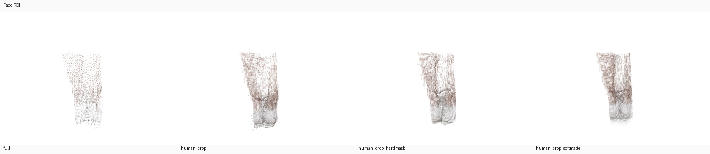
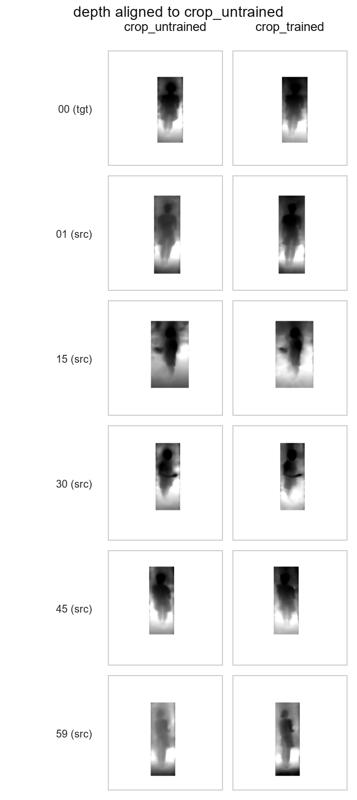
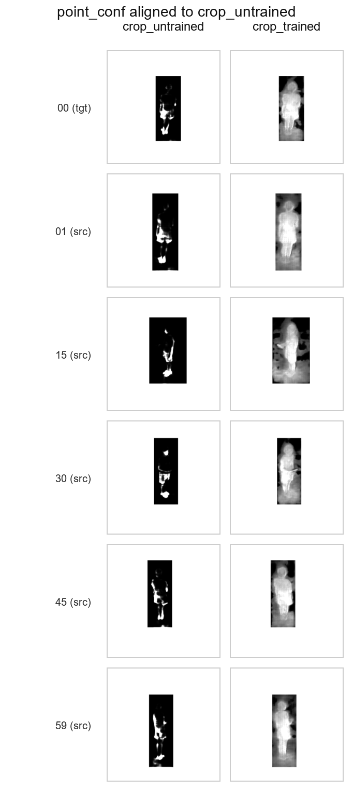
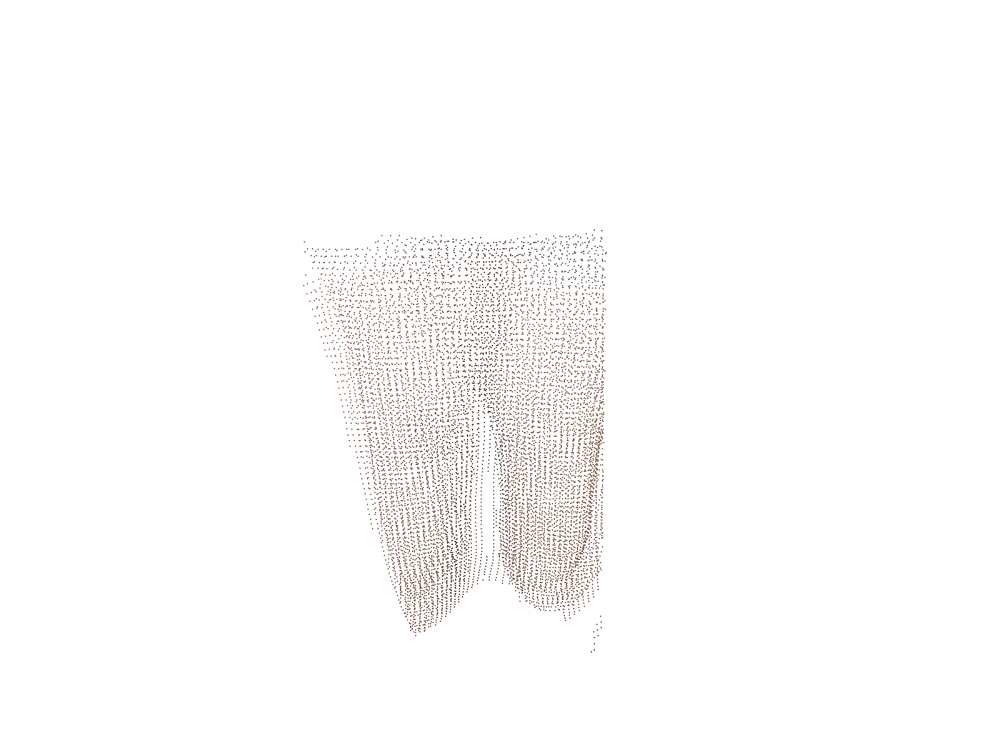
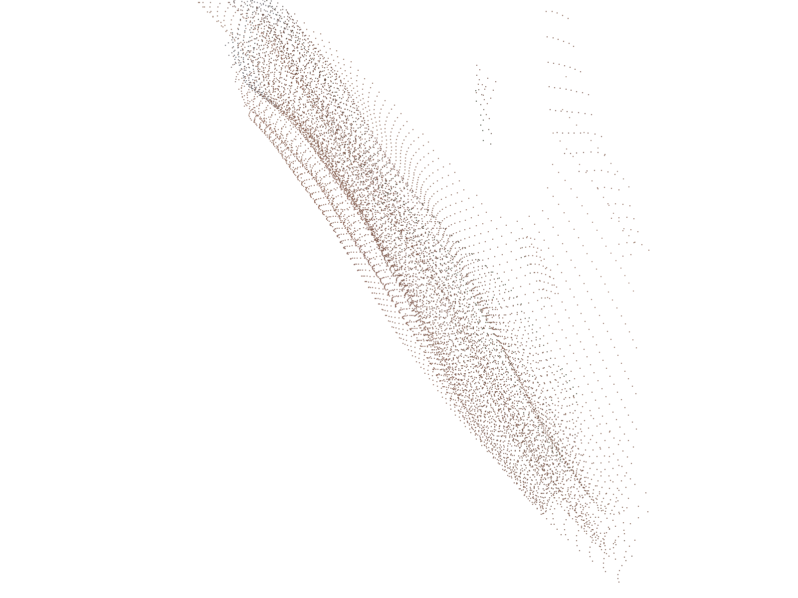
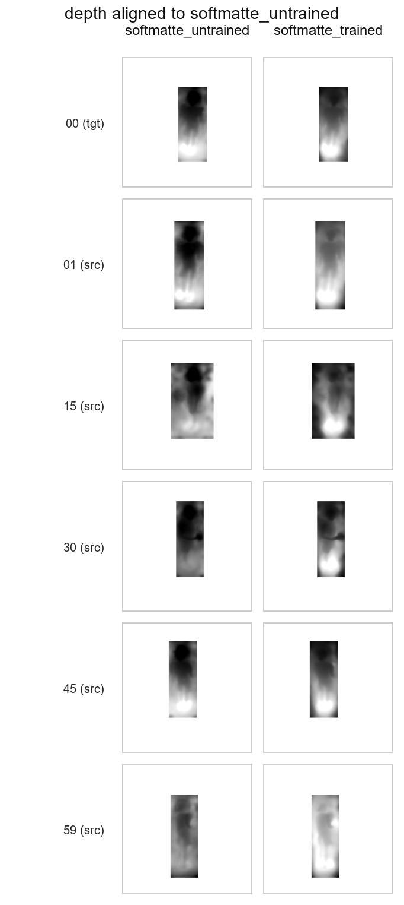
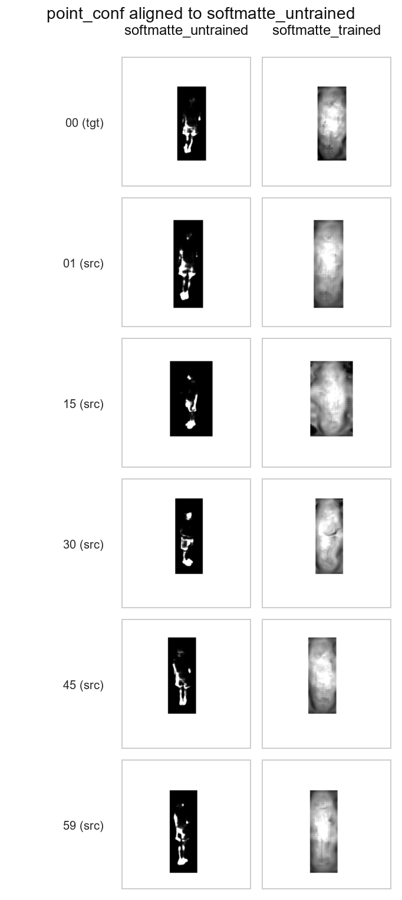
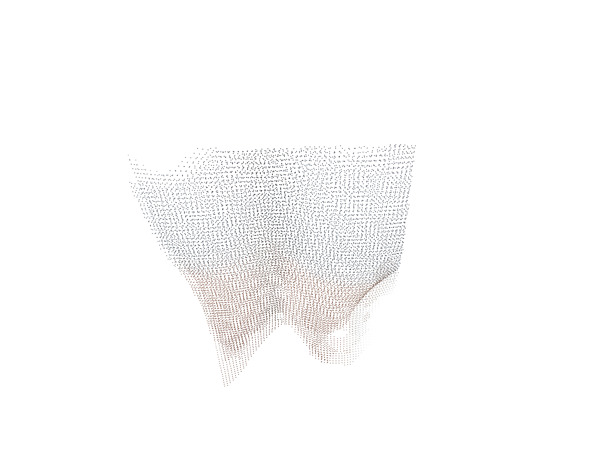
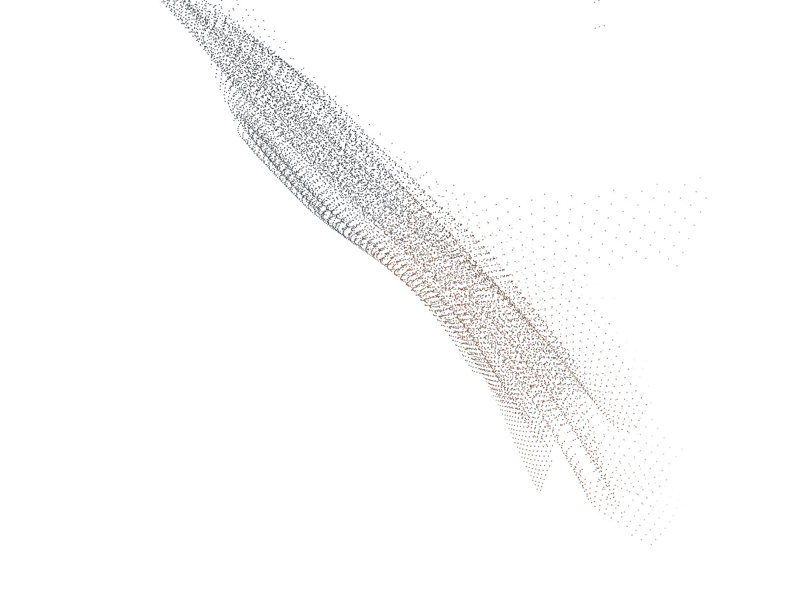

# Internal Negative-Result Supplement: Overfit Eval Report

Generated 2026-04-22 01:50:47 from existing outputs only.

## Bottom Line

- This is not a main mentor-facing result pack; it is retained as negative-result evidence.
- The single-case overfit checkpoints do not meet mentor-final quality.
- Both trained branches still collapse the face ROI toward thin planar or silhouette-like geometry in the copied `face_close` and `side` Open3D renders.
- The main numeric change is confidence inflation, not stronger 3D face structure: foreground confidence means jump from about `1.0` to `30+`, while retained face ROI points decrease in both branches.

## Key Metrics

| Branch | Depth MAE vs untrained | World-point L2 mean | Mean normal angle | Mean translation L2 | FG depth conf mean | FG world-point conf mean | Face ROI points | Face ROI z-span |
| --- | ---: | ---: | ---: | ---: | --- | --- | --- | --- |
| `crop` | 0.0470 | 0.0986 | 59.5678 | 0.0110 | 1.0001 -> 39.8261 | 1.0234 -> 34.0989 | 11,523 -> 10,952 | 0.1025 -> 0.0767 |
| `softmatte` | 0.0361 | 0.0857 | 59.2674 | 0.0136 | 1.0003 -> 34.7301 | 1.0314 -> 30.1739 | 15,127 -> 14,068 | 0.1000 -> 0.0797 |

- `crop`: face ROI points go from `11,523` to `10,952`, while the exported ROI z-span drops from `0.1025` to `0.0767` (`25.2%` narrower).
- `softmatte`: face ROI points go from `15,127` to `14,068`, while the exported ROI z-span drops from `0.1000` to `0.0797` (`20.3%` narrower).
- Inference from the summaries plus the side renders: the trained exports are not recovering facial volume; they are staying thin while moving confidence upward.

## Visual Evidence

Baseline face ROI context from the preprocess ablation:

Crop overfit branch:

Softmatte overfit branch:

## Evidence Included In This Pack

- `assets/preprocess/compare_face_roi_variants.png`
- `assets/crop_compare/depth_aligned_to_crop_untrained.png`
- `assets/crop_compare/point_conf_aligned_to_crop_untrained.png`
- `assets/crop_open3d/face_close.png`
- `assets/crop_open3d/side.png`
- `assets/softmatte_compare/depth_aligned_to_softmatte_untrained.png`
- `assets/softmatte_compare/point_conf_aligned_to_softmatte_untrained.png`
- `assets/softmatte_open3d/face_close.png`
- `assets/softmatte_open3d/side.png`
- `evidence/crop_trained_vs_untrained/comparison_summary.json`
- `evidence/crop_trained_vs_untrained/aligned_diff_summary_vs_baseline.csv`
- `evidence/softmatte_trained_vs_untrained/comparison_summary.json`
- `evidence/softmatte_trained_vs_untrained/aligned_diff_summary_vs_baseline.csv`
- `evidence/open3d/crop_trained_face_open3d_summary.json`
- `evidence/open3d/crop_untrained_face_open3d_summary.json`
- `evidence/open3d/softmatte_trained_face_open3d_summary.json`
- `evidence/open3d/softmatte_untrained_face_open3d_summary.json`

## Source Paths

- `crop` comparison summary: `output/modal_results/20260422_crop_trained_vs_untrained_compare/comparison_summary.json`
- `softmatte` comparison summary: `output/modal_results/20260422_softmatte_trained_vs_untrained_compare/comparison_summary.json`
- `crop` trained face ROI summary: `output/overfit_trained_eval_20260422/open3d_compare/crop_trained/face/open3d_summary.json`
- `crop` untrained face ROI summary: `output/preprocess_ablation_20260421/open3d_compare/crop/face/open3d_summary.json`
- `softmatte` trained face ROI summary: `output/overfit_trained_eval_20260422/open3d_compare/softmatte_trained/face/open3d_summary.json`
- `softmatte` untrained face ROI summary: `output/preprocess_ablation_20260421/open3d_compare/softmatte/face/open3d_summary.json`

## Limitations

- This is a single-case, trained-vs-untrained comparison. It is not a generalization result and it does not use external ground truth.
- The dense deltas are relative to each branch's own untrained baseline, not to a calibrated geometry target.
- The planar-collapse statement is based on the copied Open3D renders and the narrower exported ROI z-span, not on a new reconstruction metric.
